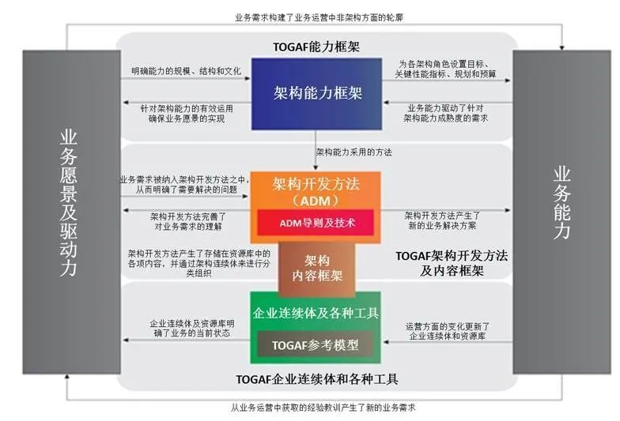

# TOGAF 7问来了解TOGAF全景及设计的核心路线图
1. 要弄懂 TOGAF的先决条件是什么?
人类没有办法理解和思考语言无法表达的东西，TOGAF看成一套知识体系，要弄懂它的先决条件就是先明确这套体系中的基本词语和基础语法.

2. 如果一个组织想要进行体系化的架构设计，它需要做哪些事情，按照什么样的步骤来进行？
TOGAF设计了一些步骤来完成架构设计，这些步骤合在一起称之为：ADM Architecture Development Method,一共9个阶段，如下海星图 
3. 在使用ADM 的时候遇到特殊情况应该咋办？
遇到特殊的一些场景如何应用ADM?这就需要两个关键概念才能管理企业架构开发的这些复杂的场景了，它们是迭代和层级，同时ADM 提供了一些技巧来解决各种场景下的架构开发：架构原则，利益干系人管理，架构特征模式，业务场景描述，差距分析等等。
4. 使用ADM 的产出物都应有什么？
- 预备阶段产出架构原则
- 阶段 A 架构愿景阶段产出业务战略，技术战略，业务原则，架构愿景，利益相关者
- 阶段 B 业务架构阶段产出企业动机，企业组织和企业功能
- 阶段 C 信息系统架构阶段产出数据架构和应用架构
- 阶段 D 技术架构阶段产出平台服务，逻辑技术构件，物理技术构件
- 阶段 E 和 F 机会点解决方案、迁移规划阶段产出工作包和架构合同
- 阶段 G 架构治理阶段产出架构标准，架构指引，架构规格
- 阶段 H 架构变革管理相当于有了新的架构愿景，因此要再走一遍 ADM

5. 如何让架构和企业保持统一且是连续的？
企业是在不断变化的，业务、技术、组织都在变化，如何让ADM 产同物能够和企业的这些变化持续保持统一，TOGAF提出了三个统一体：
* 企业连续统一体对企业总体背景环境相关的资产进行分类。
* 架构连续统一体提供一致性的试来定义架构中的一般规则，表达方式和关系。
* 解决方案连续统一体提供一致性的方式来定义解决方案的实施过程。
6. 如何实现应用的可移植性，如何实施软件系统的互操作性？
前面企业连续统一体讲的是 TOGAF 通过一些工具和方法让架构能够持续地和企业发展保持一致，但这种保持一致的代价是昂贵的。所以在第六部分 TOGAF 给出了两个模型，通过这个两个模型来实现应用的可移植性和互用性，这样就可以降低由于企业变化导致架构变化的高昂成本。
- 第一个模型是技术参考模型 TRM（Technical Reference Model），这个模型旨在强调两个公共架构的目的：
    - 通过应用平台界面实现的应用可移植性。
    - 通过通信基础设施界面实现的系统互用性。
- 第二个模型是集成的信息基础设施参考模型，这个模型是 TRM 的子集，用于实现无边界信息流的通信基础设施。翻译一下，就是如果要打破信息孤岛，那么应该如何进行软件的层面的技术架构设计。

7. 企业如何像建立业务能力一样建立架构能力？
前面五个部分看起来东西很多，概念也很复杂，但实际上都是在围绕着 ADM 架构开发方法这个东西介绍 ADM 是什么，ADM 怎么用，ADM 的产出物有什么，企业如何用 ADM 才能保持持续统一。但这些东西都是在讲事情是怎么做，最后做这些事情的还是组织，还是组织里面的人，所以第七部分就是讲应该如何建立企业架构能力。
下面是企业架构能力的整体结构图，治理机构是架构委员会，它负责制定架构合规性规范，架构契约是开发团队和治理团队之间的联合协议。
最重要的是需要基于架构能力框架建立一个有架构技能的资源池，这个资源池是一个企业进行架构开发和架构治理的核心力量。

抽象词解释
:   **制品**是 EA 项目的最小工作产品；**交付物**是 EA 项目的契约，需要正式签署，这两个都是标准化的；**构建块**是架构和解决方案的积木，是非标准化的，分不同的级别。