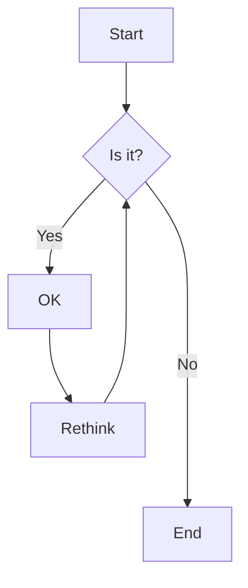
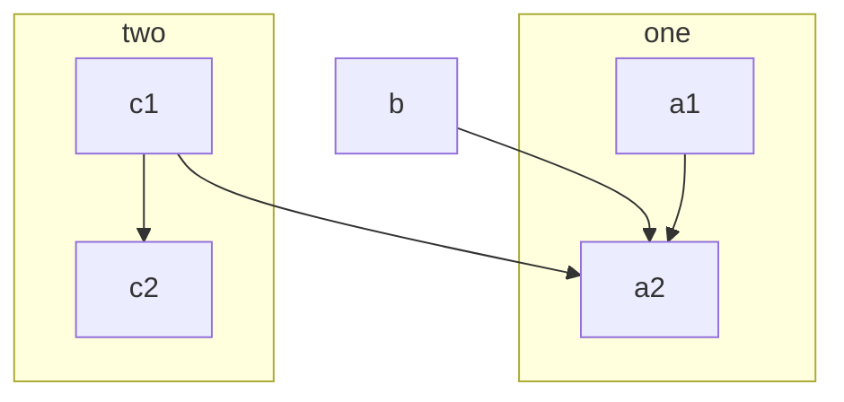
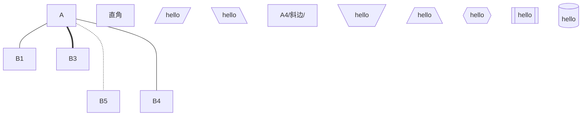
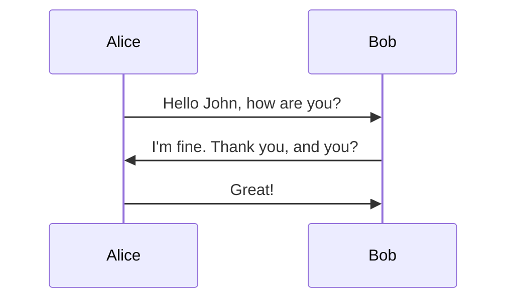
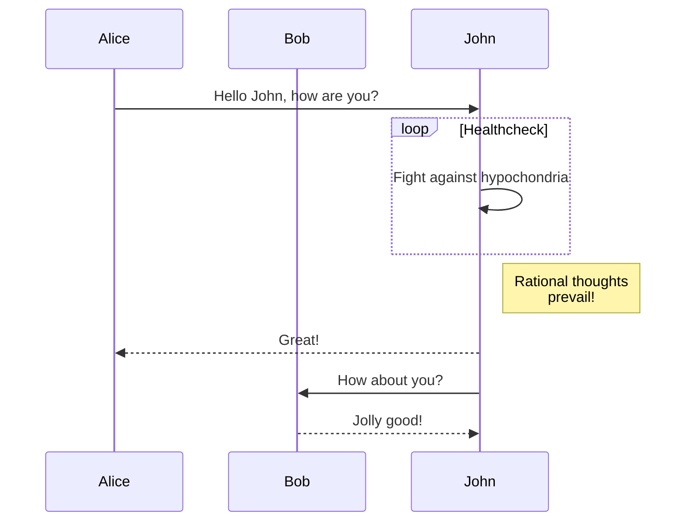
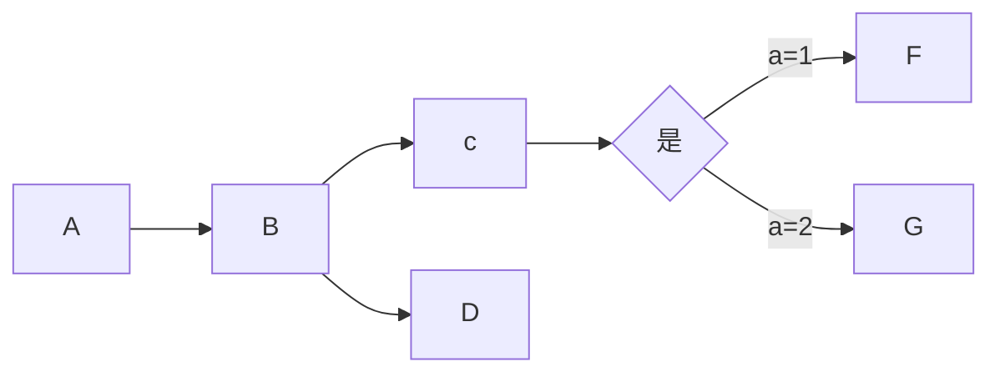
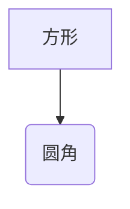
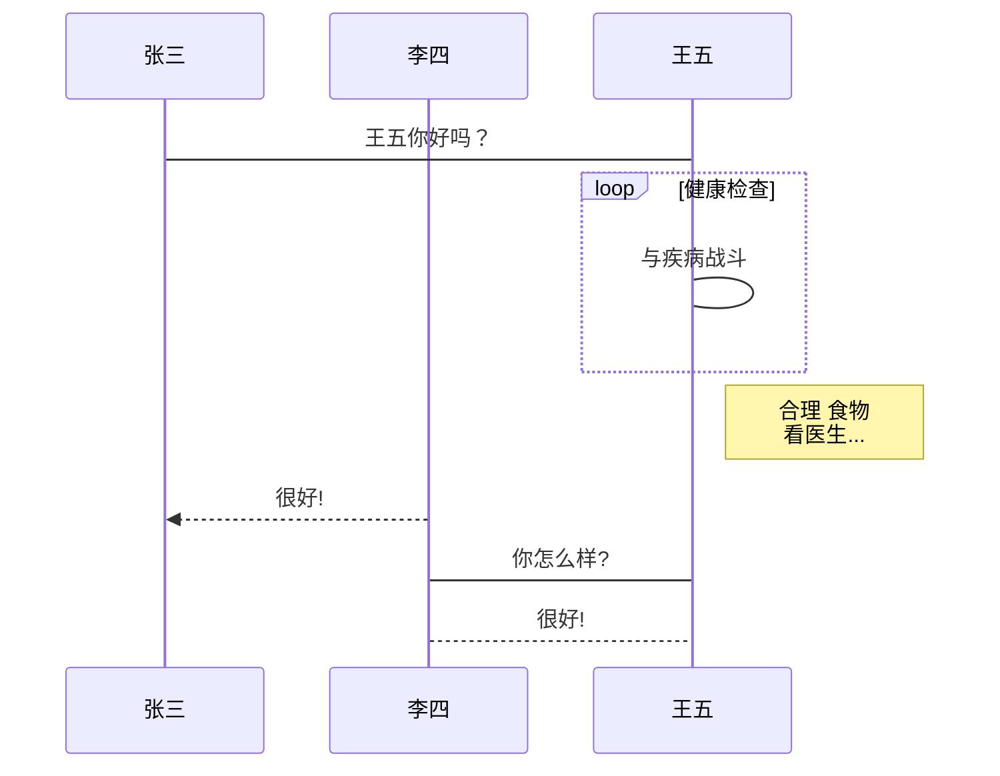

# Clean Architecuture
## URL的使用
### testsdf

[sfsfsd](http://../test.md "你好啊")

## 引用的使用 
我经常去的几个网站[GitHub][1]、[知乎][2]以及[简书][3].

[1]:https://github.com "GitHub"
[2]:https://www.zhihu.com "知乎"
[3]:https://www.jianshu.com "简书"
[写作社区]:http://jianshu.com


 
<http://example.com/>
<address@exaple.com>

## 调转目录使用 0. 目录{#index}
跳转到[目录](#index)

## 列表
  - 第一章节 sfjs;jfsf
  sfsfs;lkjf;sfs;fj;sjf;r
  sfj;lskjf
  as;fj;asfj
  sfj;asfj

- 第二章节 -
- 第三章节 -
  1. 你好啊
    - wq k af
    - sfk;skfs
        - *sfsjkf;l*

  2. 你谁啊
  3. 我是信
  4. 甩

Markdown
:   轻量级文本标记语方，可以转换成html,pdf等格式

代码块2
:   这是代码的说是明 
    for(int i=0; i<10; i++)

    ```
    for(int i=0; i<100; i++){
        
    }

*   sfsifspifsfisf[i[]]
  sfsfsfsf
sfsfsfsfsfsffs
sf
   ssfssff
*   sfsakf'askf'aksf'as
sl;kf'skf'askf'a  sljflsajf;asfs;fjks;aasfasfasfasfasf safasfjasfasff safasfa  wq vb kb 

asfljas;lfj
这是做wft什么的  桔柑fjsj；aflja；村；jasjf；asf
## 引用
> 打开文件
asf

## 分割线
---  
sfsfsdfsfsfsfsf


******

----

****

## 删除线
~~这是要删除 的~~

## 代码块
若一行代码，则直接 `java`
代码块
```java
static void mian(Strings[] args){
    for(int i=0; i<100; i++){
        System.out.pring("hellow")
    }
}
```
## 表格 

| 项目        | 价格   |  数量  |
| :--------   | -----:  | :----:  |
| 计算机     | \$1600 |   5     |
| 手机        |   \$12   |   12   |
| 管线        |    \$1    |  234  |


## 脚注

使用 Markdown[^1]可以效率的书写文档, 直接转换成 HTML[^2], 你可以使用 Typora[^T] 编辑器进行书写。
[^1]:Markdown是一种纯文本标记语言
[^2]:HyperText Markup Language 超文本标记语言
[^T]:NEW WAY TO READ & WRITE MARKDOWN.

## 特殊符号的引用
特殊符号前加\
\\
\*
\+
\.

## 制作代办事项

- [ ] 支持PDF
- [X] 已完成
## 绘制流程







## 时序图



## 横向流程格式 (mermaid)


## 竖向流程 (mermaid)




## HTML
<table>
    <tr>
        <th rowspan="2">值班人员</th>
        <th>星期一</th>
        <th>星期二</th>
        <th>星期三</th>
    </tr>
    <tr>
        <td>李强</td>
        <td>张明</td>
        <td>王平</td>
    </tr>
</table>